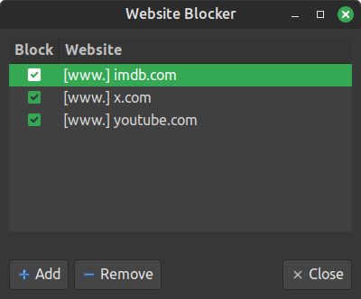

# Website Blocker for Linux

Block websites to protect your time and focus. Uses `/etc/hosts` to block sites system-wide.



## Notes

Changes take effect immediately but browsers may need their DNS cache cleared:
- Brave: Open `brave://net-internals/#dns` <a href="brave://net-internals/#dns">🔗</a> and click <kbd>Clear host cache</kbd>
- Firefox: Open `about:networking#dns` <a href="about:networking#dns">🔗</a> and click <kbd>Clear DNS Cache</kbd>
- Chrome: Open `chrome://net-internals/#dns` <a href="chrome://net-internals/#dns">🔗</a> and click <kbd>Clear host cache</kbd>

## Features

- Block and unblock websites instantly
- Unblock websites temporarily via toggle
- Blocks `www.` variant of each site automatically

## Requirements

Install PyGObject (GTK3 bindings) on Ubuntu/Linux Mint:
```sh
sudo apt install python3-gi
```

## Install (Optional)

```sh
python3 install.py
```

Installs to `~/.local/share/website-blocker/` and adds a launcher to your application menu. No root required.

## Uninstall

```sh
python3 uninstall.py
```

Removes from application menu and deletes installed files. Does not remove blocked sites from `/etc/hosts` — you must edit it manually to unblock those.

## Usage

```sh
python3 website_blocker.py
```

Or launch from your application menu after installing.

Saving to `/etc/hosts` requires root — a password prompt will appear on each save.

## How it works

Blocked sites are written to `/etc/hosts` as `127.0.0.1 example.com`, wrapped in markers:

```
# --- Website Blocker START ---
127.0.0.1 example.com
127.0.0.1 www.example.com
# --- Website Blocker END ---
```

To allow temporary unblocking, disabled entries are commented out with `#`.

## Limitations

- For blocking to work in a browser, its DNS cache must be cleared after changes.
- Blocks access at the system level — a user can edit `/etc/hosts` directly to bypass it.
- Browser extensions, VPNs, proxy or private DNS settings can bypass hosts-based blocking.
- Only blocks the exact domains added. Subdomains (e.g. `sub.example.com`) are not blocked unless added explicitly.
