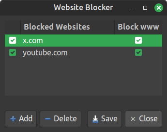

# Website Blocker for Linux

Block distracting websites to help you stay focused. Uses `/etc/hosts` to block sites system-wide.



## Features

- Block and unblock websites instantly
- Unblock websites temporarily via toggle
- Blocks `www.` variant of each site by default

## Requirements

- Python 3
- PyGObject (GTK3 bindings)
- `pkexec` (included in most Linux distributions)

Install PyGObject on Ubuntu/Linux Mint:

```sh
sudo apt install python3-gi
```

## Usage

```
# Normal Start (prompts for root password on save)
python3 website_blocker.py
# Start with root access (no root password prompt on save)
sudo python3 website_blocker.py
```

## How it works

Blocked sites are written to `/etc/hosts` as `127.0.0.1 example.com`, wrapped in markers:

```
# --- Website Blocker START ---
127.0.0.1 example.com
127.0.0.1 www.example.com
# --- Website Blocker END ---
```

Disabled entries are commented out with `#` and preserved for easy re-enabling.

## Notes

- Saving requires root access via `pkexec`.
- Changes take effect immediately but browsers may need their cache cleared:
    - Brave: Open `brave://net-internals/#dns` <a href="brave://net-internals/#dns">🔗</a> and click <kbd>Clear host cache</kbd>
    - Firefox: Open `about:networking#dns` <a href="about:networking#dns">🔗</a> and click <kbd>Clear DNS Cache</kbd>
    - Chrome: Open `chrome://net-internals/#dns` <a href="chrome://net-internals/#dns">🔗</a> and click <kbd>Clear host cache</kbd>

